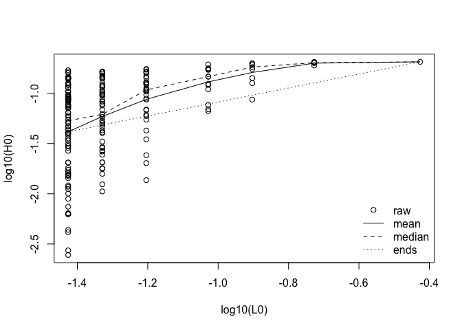

<!-- README.md is generated from README.Rmd. Please edit that file -->

# habtools

<!-- badges: start -->
<!-- badges: end -->

The goal of `habtools` is to collate tools for 3D meshes and digital
elevation models (DEM) targeted at biologists and ecologists. Tools
calculate metrics like surface area, rugosity, fractal dimension, height
range, convexity, sphericity, second moments of volume and more. The
initial set of tools came from two research papers. Zawada et al. (2019)
examined morphology of coral colony laser scans. Torres-Pulliza et
al. (2020) examined complexity of coral reef structure. It is hoped that
the number of tools and contributors will grow through time.

## Installation

You can install the development version from
[GitHub](https://github.com/) with:

``` r
# install.packages("devtools")
devtools::install_github("jmadinlab/habtools")
```

## Examples

There are currently to data set accompanying this package. `horseshoe`
is a digital elevation model of a reef, and `mcap` is a 3D mesh of a
coral growing on a reef.

The following example calculates height range, rugosity and fractal
dimension of a 2 x 2 m plot of reef using the height range method
developed in Torres-Pulliza et al. (2020).

``` r
library(habtools)
#> Loading required package: raster
#> Loading required package: sp
plot(horseshoe)

# height range
hr(horseshoe, x=-470, y=1266, L=2, plot=TRUE)
#> [1] 1.091781

# rugosity; note that rugosity will increase with grain (L0)
rg(horseshoe, x=-470, y=1266, L=2, L0=0.25, plot=TRUE)
```


    #> [1] 1.398074

    # fractal dimension is broken into two parts
    # 1. Collate height variation in grids of different resolutions
    hts <- hvar(horseshoe, x=-470, y=1266, L=2, Lvec=2/c(1, 2, 4, 8))

    # 2. Use the height variation data to calculate fractal dimension
    fd(hts)
    #> [1] 2.289402

    # Here is the log-log plot with various `methods` superimposed
    fd(hts, plot=TRUE)


    #> [1] 2.289402

The next example calculates height range, rugosity and fractal dimension
for a 3D mesh of a coral colony. Because meshes can have more than one
`z` coordinate for a given `xy` (i.e., they have overhangs), we use the
cube counting fractal dimension method developed in Zawada et
al. (2019).

``` r
# height range
hr(mcap, method="mesh")
#> [1] 0.2185397

# fractal dimension
cubes(mcap, L0=0.015, plot=TRUE)
```


    #> $cubes
    #>           L0   n
    #> 1 0.40931573   1
    #> 2 0.20465787   8
    #> 3 0.10232893  31
    #> 4 0.05116447 141
    #> 5 0.02558223 528
    #> 
    #> $fd
    #> [1] 2.222834

You can use the `mesh_to_dem` function and now compare fractal dimension
calculated with the two methods. Note that we expect these to be
somewhat different is only because DEMs do not include overhangs (i.e.,
they have one `z` per `xy` pair; or as some people say, they are 2.5D,
not 3D).

``` r
dem <- mesh_to_dem(mcap, res=0.015)
L <- dim(dem)[1] * res(dem)[1]

hts <- hvar(dem, xmin(dem), ymin(dem), L, Lvec=L/c(1, 2, 3, 4, 6, 8, 10))
fd(hts, plot=TRUE)
```



    #> [1] 2.287082
