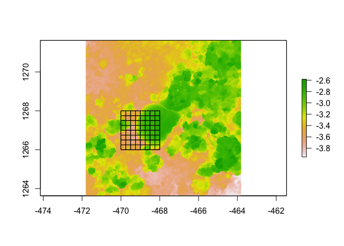
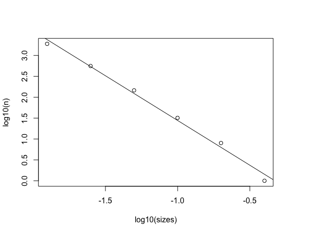
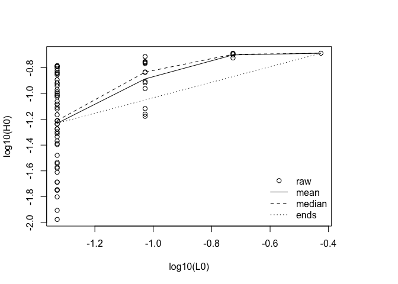

<!-- README.md is generated from README.Rmd. Please edit that file -->

# habtools

<!-- badges: start -->
<!-- badges: end -->

The goal of habtools is to collate tools for 3D meshes and digital
elevation models (DEM) targetted at biologists and ecologists. Tools
calculate metrics like surface area, rugosity, fractal dimension, heigh
range, convexity, sphericity, second moments of volume and more. The
initial set of tools came from two research papers.Zawada et al. (2019)
examined morphology of coral colony laser scans. Torres-Pulliza et
al. (2020) examined complexity of coral reef structure. It is hoped that
the corpus of tools and number of project contributors will grow through
time.

## Installation

You can install the released version of habtools from
[CRAN](https://CRAN.R-project.org) with:

``` r
install.packages("habtools")
```

And the development version from [GitHub](https://github.com/) with:

``` r
# install.packages("devtools")
devtools::install_github("jmadinlab/habtools")
```

## Example

This is a basic example which shows you how to solve a common problem:

``` r
library(habtools)

# Calculate height range, rugosity & fractal dimension at horseshoe reef
# within 2 x 2 m plot (extent) and at 0.25 m resolution (grain)

raster::plot(horseshoe, asp=1)

hr(horseshoe, x=-470, y=1266, L=2, plot=TRUE)
#> [1] 1.091781
rg(horseshoe, x=-470, y=1266, L=2, L0=0.25, plot=TRUE)
```



    #> [1] 1.398074

    L <- 2
    data <- hvar(horseshoe, x=-470, y=1266, L=L, Lvec=L/c(1, 2, 4, 8))
    fd(data, method="mean")
    #> [1] 2.289402

    # Compare fractal dimension of `M. capitata` colony using
    # height variation and cube counting methods

    cubes(mcap, L0=0.01, plot=TRUE)



    #> $cubes
    #>           L0    n
    #> 1 0.39931573    1
    #> 2 0.19965787    8
    #> 3 0.09982893   32
    #> 4 0.04991447  146
    #> 5 0.02495723  558
    #> 6 0.01247862 1893
    #> 
    #> $fd
    #> [1] 2.142699

    dem <- mesh_to_dem(mcap, res=0.015)
    L <- dim(dem)[1] * raster::res(dem)[1]
    data <- hvar(dem, raster::xmin(dem), raster::ymin(dem), L, Lvec=L/c(1, 2, 4, 8))
    fd(data, plot=TRUE, method="ends")



    #> [1] 2.397906

What is special about using `README.Rmd` instead of just `README.md`?
You can include R chunks like so:

``` r
# summary(horseshoe)
```

You’ll still need to render `README.Rmd` regularly, to keep `README.md`
up-to-date. `devtools::build_readme()` is handy for this. You could also
use GitHub Actions to re-render `README.Rmd` every time you push. An
example workflow can be found here:
<https://github.com/r-lib/actions/tree/master/examples>.

You can also embed plots, for example:

In that case, don’t forget to commit and push the resulting figure
files, so they display on GitHub and CRAN.
