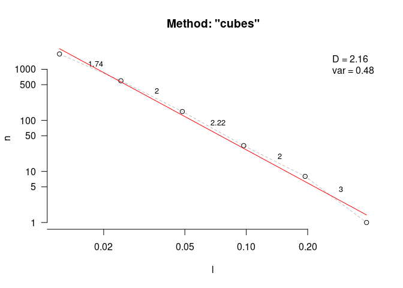

<!-- README.md is generated from README.Rmd. Please edit that file -->

# `habtools`: 3D metrics for surfaces and objects

<!-- badges: start -->

[](https://github.com/jmadinlab/habtools/actions/workflows/R-CMD-check.yaml)
<!-- badges: end -->


`habtools` is a collection of tools for working with 3D surfaces and
meshes for biologists and ecologists. There are helper tools for
sampling and simulating surfaces, as well as tools for estimating
metrics like surface area, rugosity, fractal dimension, convexity,
sphericity, second moments of volume, circularity and more.

### Installation

A CRAN version of `habtools` is forthcoming. You can also install the
development version from [GitHub](https://github.com/) with:

``` r
# install.packages("devtools")
devtools::install_github("jmadinlab/habtools")
```

### Examples

There are vignettes demonstrating the use of `habtools` for digital
elevation models (DEMs) and 3D meshes, as well as a vignette covering
fractal dimension methods.

There are currently two data sets accompanying this package. `horseshoe`
is a DEM of a coral reef in RasterLayer format, and `mcap` is a 3D mesh
of a coral growing on a reef in mesh3d format.

The following example calculates height range, rugosity and fractal
dimension of a 2 x 2 m plot of `horseshoe`.

``` r
library(habtools)
library(raster)

# Let's take a subset DEM of size = 2
dem <- dem_crop(horseshoe, x0 = -465, y0 = 1265, L = 2, plot = TRUE)
```


``` r

# height range
hr(dem)
#> [1] 1.368289

# rugosity
rg(dem, L0 = 0.0625)
#> [1] 1.75829

# fractal dimension
fd(dem, method = "hvar", keep_data = TRUE, plot=TRUE, diagnose = TRUE)
```


    #> $D
    #> [1] 2.159332
    #> 
    #> $data
    #>        l          h
    #> 1 0.0625 0.07207143
    #> 2 0.1250 0.16465515
    #> 3 0.2500 0.31394699
    #> 4 0.5000 0.58224221
    #> 5 1.0000 0.88901201
    #> 6 2.0000 1.36828852
    #> 
    #> $lvec
    #> [1] 0.0625 0.1250 0.2500 0.5000 1.0000 2.0000
    #> 
    #> $D_vec
    #> [1] 1.808052 2.068927 2.108902 2.389417 2.377902
    #> 
    #> $var
    #> [1] 0.2420993
    #> 
    #> $method
    #> [1] "hvar"

The next example calculates height range, rugosity and fractal dimension
for the coral colony `mcap`. Because 3D meshes can have more than one
`z` coordinate for a given `xy` (i.e., they have overhangs), we use cube
counting for fractal dimension.

``` r
library(rgl)
options(rgl.printRglwidget = TRUE)
plot3d(mcap)
```


``` r
# height range
hr(mcap)
#> [1] 0.2185397

# rugosity
rg(mcap, L0 = 0.045)
#> [1] 2.882813

# fractal dimension
fd(mcap, method = "cubes", keep_data = TRUE, plot=TRUE, diagnose = TRUE)
#> lvec is set to c(0.053, 0.106, 0.212, 0.423).
```



    #> $D
    #> [1] 2.315246
    #> 
    #> $data
    #>            l   n
    #> 4 0.05291204 134
    #> 3 0.10582408  31
    #> 2 0.21164817   8
    #> 1 0.42329634   1
    #> 
    #> $lvec
    #> [1] 0.42329634 0.21164817 0.10582408 0.05291204
    #> 
    #> $D_vec
    #> [1] 2.111893 1.954196 3.000000
    #> 
    #> $var
    #> [1] 0.5638126
    #> 
    #> $method
    #> [1] "cubes"
