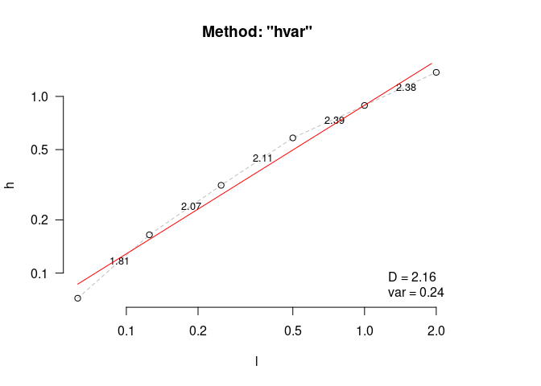

<!-- README.md is generated from README.Rmd. Please edit that file -->

# habtools 

<!-- badges: start -->

[](https://github.com/jmadinlab/habtools/actions/workflows/R-CMD-check.yaml)
[](https://CRAN.R-project.org/package=habtools)
[](https://CRAN.R-project.org/package=habtools)
<!-- badges: end -->

A collection of functions for sampling and simulating 3D surfaces and
objects and estimating metrics like rugosity, fractal dimension,
convexity, sphericity, circularity, second moments of area and volume,
and more.

### Citation

When using `habtools`, please cite the following reference:  
Schiettekatte, N., Asbury, M., Chen, G. K., Dornelas, M., Reichert, J.,
Torres-Pulliza, D., Zawada, K. J. A., & Madin, J. S. (2025). habtools:
An R package to calculate 3D metrics for surfaces and objects. Methods
in Ecology and Evolution, 00, 1–9.
<https://doi.org/10.1111/2041-210X.70027>”

### Installation

The best way to install `habtools` is through cran.

``` r
install.packages("habtools")
```

You can also install the development version from
[GitHub](https://github.com/) with:

``` r
# install.packages("devtools")
devtools::install_github("jmadinlab/habtools")
```

### Examples

There are vignettes demonstrating the use of `habtools` for digital
elevation models (DEMs) and 3D meshes, as well as a vignette covering
fractal dimension methods.

There are currently two data sets accompanying this package. `horseshoe`
is a DEM of a coral reef in RasterLayer format, and `mcap` is a 3D mesh
of a coral growing on a reef in mesh3d format.

The following example calculates height range, rugosity and fractal
dimension of a 2 x 2 m plot of `horseshoe`.

``` r
library(habtools)
library(raster)

# Let's take a subset DEM of size = 2
dem <- dem_crop(horseshoe, x0 = -465, y0 = 1265, L = 2, plot = TRUE)
```


``` r

# height range
hr(dem)
#> [1] 1.368289

# rugosity
rg(dem, L0 = 0.0625)
#> [1] 1.732286

# fractal dimension
fd(dem, method = "hvar", keep_data = TRUE, plot=TRUE, diagnose = TRUE)
```



    #> $D
    #> [1] 2.159332
    #> 
    #> $data
    #>        l          h
    #> 1 0.0625 0.07207143
    #> 2 0.1250 0.16465515
    #> 3 0.2500 0.31394699
    #> 4 0.5000 0.58224221
    #> 5 1.0000 0.88901201
    #> 6 2.0000 1.36828852
    #> 
    #> $lvec
    #> [1] 0.0625 0.1250 0.2500 0.5000 1.0000 2.0000
    #> 
    #> $D_vec
    #> [1] 1.808052 2.068927 2.108902 2.389417 2.377902
    #> 
    #> $var
    #> [1] 0.2420993
    #> 
    #> $method
    #> [1] "hvar"

The next example calculates height range, rugosity and fractal dimension
for the coral colony `mcap`. Because 3D meshes can have more than one
`z` coordinate for a given `xy` (i.e., they have overhangs), we use cube
counting for fractal dimension.

``` r
library(rgl)
options(rgl.printRglwidget = TRUE)
plot3d(mcap)
```


``` r
# height range
hr(mcap)
#> [1] 0.2185397

# rugosity
rg(mcap, L0 = 0.045)
#> [1] 2.790366

# fractal dimension
fd(mcap, method = "cubes", keep_data = TRUE, plot=TRUE, diagnose = TRUE)
#> lvec is set to c(0.012, 0.024, 0.049, 0.097, 0.194, 0.389).
```


    #> $D
    #> [1] 2.162501
    #> 
    #> $data
    #>            l    n
    #> 6 0.01214766 1995
    #> 5 0.02429533  596
    #> 4 0.04859066  149
    #> 3 0.09718131   32
    #> 2 0.19436262    8
    #> 1 0.38872525    1
    #> 
    #> $lvec
    #> [1] 0.38872525 0.19436262 0.09718131 0.04859066 0.02429533 0.01214766
    #> 
    #> $D_vec
    #> [1] 1.743005 2.000000 2.219169 2.000000 3.000000
    #> 
    #> $var
    #> [1] 0.4819041
    #> 
    #> $method
    #> [1] "cubes"
