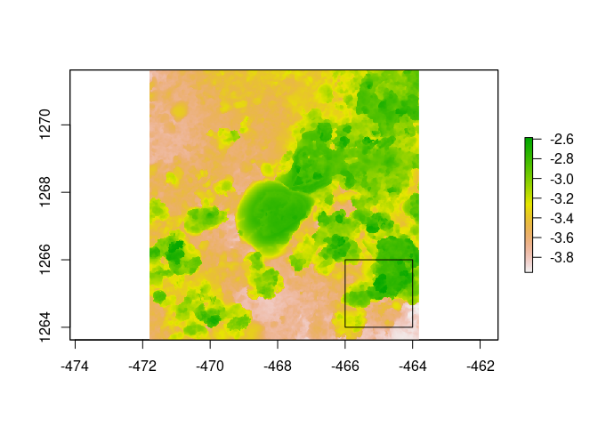
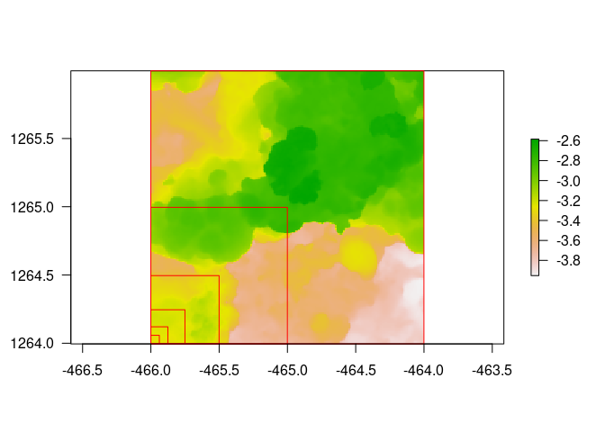

<!-- README.md is generated from README.Rmd. Please edit that file -->

# habtools

<!-- badges: start -->

[](https://github.com/jmadinlab/habtools/actions/workflows/R-CMD-check.yaml)
<!-- badges: end -->

The goal of `habtools` is to collate tools for 3D meshes and digital
elevation models (DEM) targeted at biologists and ecologists. Tools
calculate metrics like surface area, rugosity, fractal dimension, height
range, convexity, sphericity, second moments of volume and more.

## Installation

You can install the development version from
[GitHub](https://github.com/) with:

``` r
# install.packages("devtools")
devtools::install_github("jmadinlab/habtools")
```

## Examples

There are currently two data set accompanying this package. `horseshoe`
is a digital elevation model of a reef in RasterLayer format, and `mcap`
is a 3D mesh of a coral growing on a reef in mesh3d format.

The following example calculates height range, rugosity and fractal
dimension of a 2 x 2 m plot of reef using the height range method
developed in Torres-Pulliza et al. (2020).

``` r
library(habtools)
library(raster)
#> Loading required package: sp
#> 
#> Attaching package: 'raster'
#> The following object is masked from 'package:habtools':
#> 
#>     extent
plot(horseshoe)

# Let's take a subset DEM of size = 2
dem2 <- crop_dem(horseshoe, x0 = -465, y0 = 1265, L = 2, plot = TRUE)
```



``` r
plot(dem2)
```



``` r

# height range
hr(dem2)
#> [1] 1.368289

# rugosity; note that rugosity will decrease with grain (L0). L0 should always be equal to or greater than the resolution (in this example, the resolution = 0.01). 
rg(dem2, L0 = 0.1)
#> [1] 1.595773

# fractal dimension
fd(dem2, lvec = c(0.25, 0.5, 1, 2), diagnose = TRUE, method = "hvar", keep_data = TRUE)
```


    #> $D
    #> [1] 2.301808
    #> 
    #> $data
    #>      l         h
    #> 1 0.25 0.3139470
    #> 2 0.50 0.5822422
    #> 3 1.00 0.8890120
    #> 4 2.00 1.3682885
    #> 
    #> $D_vec
    #> [1] 2.108902 2.389417 2.377902
    #> 
    #> $var
    #> [1] 0.158736
    #> 
    #> $method
    #> [1] "hvar"

The next example calculates height range, rugosity and fractal dimension
for a 3D mesh of a coral colony. Because meshes can have more than one
`z` coordinate for a given `xy` (i.e., they have overhangs), we advise
the cube counting fractal dimension method presented in Zawada et
al. (2019).

``` r
library(rgl)
plot3d(mcap)

# height range
hr(mcap)
#> [1] 0.2185397

# rugosity
rg(mcap, L0 = 0.045)
#> [1] 2.882813

# fractal dimension
fd(mcap, diagnose = TRUE, method = "cubes", keep_data = TRUE)
#> [1] "lvec is set to c(0.423, 0.212, 0.106, 0.053)."
```


    #> $D
    #> [1] 2.315246
    #> 
    #> $data
    #>            l   n
    #> 4 0.05291204 134
    #> 3 0.10582408  31
    #> 2 0.21164817   8
    #> 1 0.42329634   1
    #> 
    #> $D_vec
    #> [1] 2.111893 1.954196 3.000000
    #> 
    #> $var
    #> [1] 0.5638126
    #> 
    #> $method
    #> [1] "cubes"
